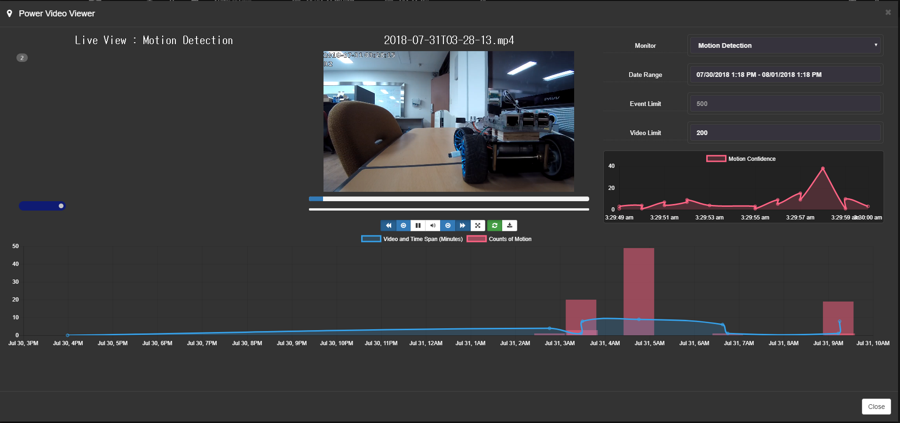
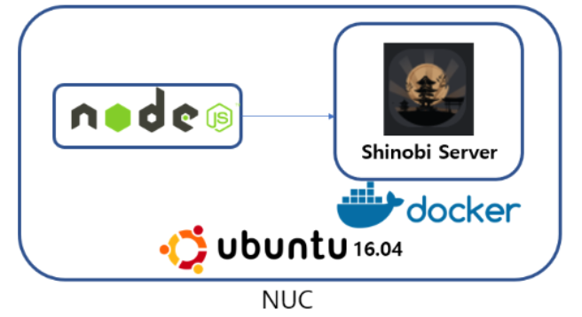

<html>
  
  
# Shinobi
## Features
Time-lapse Viewer (Watch a hours worth of footage in a few minutes) 
 
Records IP Cameras and Local Cameras 
Streams by WebSocket, HLS (includes audio), and MJPEG 
Save to WebM and MP4 - Can save Audio 
 
Push Events - When a video is finished it will appear in the dashboard without a refresh 
1 Process for Each Camera to do both, Recording and Streaming 
Cron Filters can be set based on master account 
 
## Installation
### In Ubuntu 16.04:
<code>sudo su</code> 
<code>apt install git -y</code> 
<code>git clone https://gitlab.com/Shinobi-Systems/Shinobi.git Shinobi</code> 
<code>cd Shinobi</code> 
<code>chmod +x INSTALL/ubuntu.sh && INSTALL/ubuntu.sh</code> 
### Shinobi does some of his own questions :
Shinobi - Do you want to enable superuser access? 
Shinobi - Do you want to Install FFMPEG? 
Shinobi - Do you want to use MariaDB or SQLite3? 
Shinobi - Do you want to Install MariaDB? Choose No if you already have it. 
Shinobi - Database Installation 
Shinobi - Start Shinobi and set to start on boot? 
 
### To update Shinobi with git and restart :
<code>cd Shinobi</code> 
<code>git pull</code> 
<code>pm2 restart camera.js</code> 
<code>pm2 restart cron.js</code> 
 
http://localhost:8080/ 
 
### To use docker : 
<code>sudo apt install git</code> 
<code>git clone https://gitlab.com/Shinobi-Systems/ShinobiDocker.git ShinobiDocker && cd ShinobiDocker</code> 
<code>apt install docker-compose</code> 
<code>sh start-image.sh</code> 

Web Address : http://xxx.xxx.xxx.xxx:8080/super 

## Modify
### After config:
Default Login 
[ docker-entrypoint.sh ] 
<code>mysql -u root <  /opt/shinobi/sql/framework.sql</code> 
<code>mysql --user=root ccio < /opt/shinobi/sql/default_data.sql</code> 
<code>mysql -u root --password="" <<-EOSQL</code> 
<code>INSERT INTO mysql.user (host,user,authentication_string,ssl_cipher, x509_issuer, x509_subject) VALUES ('%','root',password(''),'','','');</code> 
<code>GRANT ALL PRIVILEGES ON *.* TO 'root'@'%';</code> 
<code>FLUSH PRIVILEGES;</code> 
<code>EOSQL</code> 

Plus Motion Detection 
 
[ Dockerfile ] 
[ pm2Shinobi.yml ] 

## Test API
 

## link
https://shinobi.video/docs/start 
https://gitlab.com/Shinobi-Systems/Shinobi 
 
</html>
